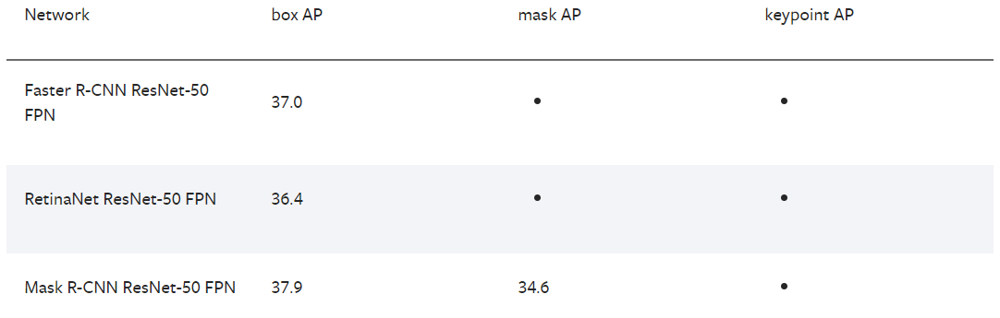
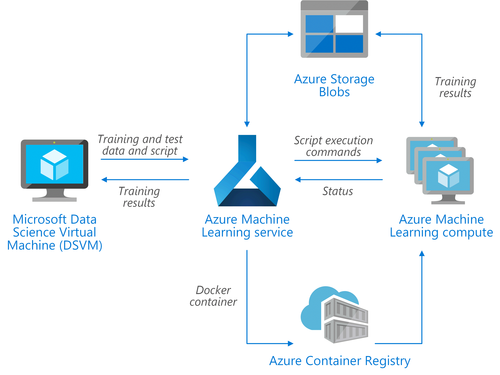

# Custom Vision vs Own Model for object detection

### Skład zespołu
1. Ivan Prakapets,
2. Aliaksandr Karolik,
3. Jakub Korczakowski,
4. Piotr Rosa,
5. Bartosz Puszkarski.

### Opis projektu
Celem naszego projektu jest zapoznanie się z usługą Custom Vision na platformie Azure [start](https://azure.microsoft.com/en-us/services/cognitive-services/custom-vision-service/) oraz poszerzenie wiedzy z dziedziny widzenia komputerowego przez porównanie własnej modeli z usługą udostępnioną przez Microsoft. [dokumentacja do startu Custom Vision](https://docs.microsoft.com/en-us/azure/cognitive-services/custom-vision-service/getting-started-build-a-classifier).

Usługa Custom Vision jest częścią chmurowych usług Cognitive Services na platformie Azure.

### Zbiory danych

W celu porówniania działania onu serwisów planujemy sprawdzić trzy zbiory danych, różnią się one wielkością. Wszystkie z nich zawierają obrazy wraz z otagowanymi obiektami (tagi w plikach `.xml` lub `.txt`).

- Monkey, Cat and Dog detection (30 MB) - https://www.kaggle.com/tarunbisht11/yolo-animal-detection-small,
- street object detection dataset (228 MB) - https://www.kaggle.com/fantacher/bd-street-object-detection-dataset,
- Labeled Surgical Tools and Images (734 MB) - https://www.kaggle.com/dilavado/labeled-surgical-tools.

Zbiorem referncyjnym w zadaniu detekcji obiektów jest zbiór COCO (https://cocodataset.org/#home). Jeśli zasoby dostępne na Azure umożliwią nam to planujemy użycie także tego zbioru.

### Funkcjonalności
W  wyniku realizacji naszego projektu powstanie raport zawierające opis  przeprowadzonych badań oraz zostaną dostarczone wytrenowane modeli na wyżej omówionych zbiorach danych. W zależności od zbioru na którym model będzie trenowany powstaną modeli do detekcji:

1.  Model do rozpoznawania kotów, psów oraz małp. 
2.  Model do rozpoznawania ludzi, samochodów, motocykli, trójkolowiece, rikszy, autobus, policję drogową oraz ciężarówki.
3.  Model do rozpoznawania oprzyrządowania medycznego (skalpel, pinceta, nożyczki chirurgiczne proste, nożyczki chirurgiczne zagięte)

Raport końcowy będzie zawierał następujące rozdziały: 
 - Wstęp teoretyczny 
 - Architektury modeli 
 - Porównanie wyników modeli dla wszyskich zbiorów danych
 - Wnioski 
 
### Modele
Azure Custom Vision dostarcza możliwość wykorzystania dwóch rodzai modeli do widzenia komputerowego: modelu do klasyfikacji obrazów oraz modelu do detekcji obiektów. W naszym projekcie wykorzystamy drugi typ, ponieważ skupiamy się na wykrywaniu różnego rodzaju obiektów występujących na zdjęciach.

Drugim modelem który zostanie wytrenowany, którego wydajność porównamy z możliwościami Azure Custom Vision, będzie Mask R-CNN ResNet-50 FPN. Do trenowania tego modelu wykorzystamy bibliotekę Pytorch. Zdecydowaliśmy się na wybór tego modelu ze względu na to, że w dokumentacji wspomnianej biblioteki Pytorch osiąga on najlepsze rezultaty z dostępnych modeli. 

### Diagram

### Stos technologiczny
- Microsoft Azure Storage Blocks,
- Azure Machine Learning Services,
- Microsoft Azure Custom Vision,
- Microsoft Azure Machine Learning Compute Cluster
- Python3, PyTorch, NumPy, SciPy,

### Kamienie milowe
1. Diagramy architektury oraz określenie zakresu prac i funkcjonalności.
2. ...

### Harmonogram

| Lp. | Data | Zadanie | 
| -------- | ------------- | ------------------------------------------------- |
| 1        | 26.11.2020          | P2 - przedstawienie architektury projektu i tworzonych artefaktów                                |
| 2    | 10.12.2020 | P3 - check-point|                                                              |
| 3   | 07.01.2021 | P4 |
| 4   | 14.01.2021 | P5 - middle-check point |
| 5   | 21.01.2021 | P6 |
| 6   | 28.01.2021 | P7 - prezentacja projektów                                   |                                                              |

### Przydatne materiały

Object detection w Custom Vision - https://docs.microsoft.com/en-us/azure/cognitive-services/custom-vision-service/get-started-build-detector

Modele Torch Vision - https://pytorch.org/docs/stable/torchvision/models.html

Trenowanie modelu Pytorch - https://pytorch.org/tutorials/intermediate/torchvision_tutorial.html

